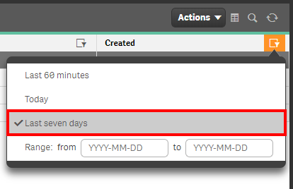

# Check for New Apps <i class="fas fa-dolly-flatbed fa-xs" title="Shipped | Native Capability"></i> <i class="fas fa-file-code fa-xs" title="API | Requires Script"></i>

## Applicable Environments
- Development

## Goal
While the idea of simply checking for new applications seems relatively trivial and not particularly actionable, it is a good practice as it only takes a couple of minutes and could save you finding out about a very large app in a more unpleasant fashion (i.e. your engine node locking up). This page shows you two methods of visualizing/gathering that high-level application data on newly created applications so that you can be aware/potentially report on it.

--------------------------

## QMC - Apps <i class="fas fa-dolly-flatbed fa-xs" title="Shipped | Native Capability"></i>

In the QMC, select **Apps**:

[](https://raw.githubusercontent.com/qs-admin-guide/qs-admin-guide/master/docs/asset_management/apps/images/check_new_apps_native_1.png)

In the upper right hand side of the screen, select the **Column selector**, and then selected the **File size (MB)** and **Created** columns. If you'd like to make the resulting table a bit more manageable, you can also optionally deselect additional columns like **Version** and **Tags**.

[](https://raw.githubusercontent.com/qs-admin-guide/qs-admin-guide/master/docs/asset_management/apps/images/check_new_apps_native_2.png)

Now select the filter icon for the **Created** column, and then select the filter of **Today** (or **Last seven days** if you'd like a slightly larger rolling window).

[](https://raw.githubusercontent.com/qs-admin-guide/qs-admin-guide/master/docs/asset_management/apps/images/check_new_apps_native_3.png)

Lastly, you can review the resulting table and view any new apps, noting their file sizes. If any are particularly large, it might be worthwhile to follow-up with the owner of the application, and possibly do further analysis in with the App Metadata Analyzer.

[](https://raw.githubusercontent.com/qs-admin-guide/qs-admin-guide/master/docs/asset_management/apps/images/check_new_apps_native_4.png)

--------------------------

## Get List of New Apps (Qlik CLI) <i class="fas fa-file-code fa-xs" title="API | Requires Script"></i>

The below script snippet requires the [Qlik CLI](docs/tooling/qlik_cli.md).

The script will bring back any application that is greater than or equal to x days old _and_ greater than or equal to z bytes. The script will then store the output into the location of your choice in either csv or json format.

```powershell
# Function to collect applications that were created in the last x days over z size in bytes

# Parameters
# Assumes default credentials are used for the Qlik CLI Connection
$computerName = 'machineName'
$virtualProxyPrefix = '/default' # leave empty if windows auth is on default VP
$daysBack = 1
$byteSize = 0
$filePath = 'C:\'
$fileName = 'output'
$outputFormat = 'json'

$outFile = ($filePath + $fileName + '.' + $outputFormat)
$date = (Get-Date -date $(Get-Date).AddDays(-$daysBack) -UFormat '+%Y-%m-%dT%H:%M:%S.000Z').ToString()
$computerNameFull = ($computerName + $virtualProxyPrefix).ToString()

# Main
Connect-Qlik -ComputerName $computerNameFull -UseDefaultCredentials -TrustAllCerts

If ($outputFormat.ToLower() -eq 'csv') {
  Get-QlikApp -filter "createdDate ge '$date' and fileSize ge $byteSize" -full | ConvertTo-Csv -NoTypeInformation | Set-Content $outFile
  }  Else {
  Get-QlikApp -filter "createdDate ge '$date' and fileSize ge $byteSize" -full | ConvertTo-Json | Set-Content $outFile
} 
```

**Tags**

#weekly
