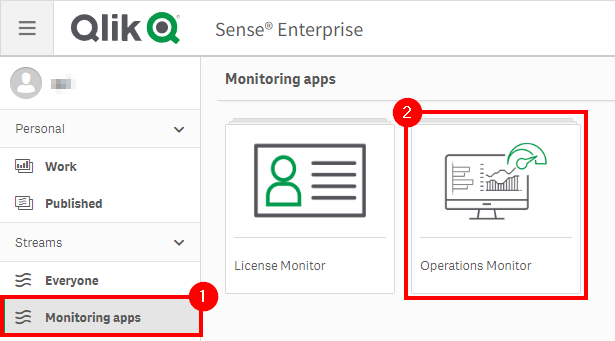

# Remove Unused Private Sheets <i class="fas fa-dolly-flatbed fa-xs" title="Shipped | Native Capability"></i> <i class="fas fa-tools fa-xs" title="Tooling | Pre-Built Solutions"></i> <i class="fas fa-file-code fa-xs" title="API | Requires Script"></i>
{:.no_toc}

<span class="label prod">production w/ self-service</span>

|                                  		          | Initial | Recurring |
|---------------------------------------------------------|---------|------------|
| <i class="far fa-clock fa-sm"></i> **Estimated Time**   | 1-2 hr  | 30 min     |

Benefits:

  - Increase performance
  - Reduce maintenance
  
-------------------------

## Goal
{:.no_toc}
In environments where self-service is enabled, i.e. users have the ability to create their own private sheets on published applications, with a high number of users, the number of private sheets can ultimately grow very large. The goal of this section is to illustrate how to put policies/practices in place to consistently keep the number of private sheets under control--allowing for a tidy/more performant site.

**Note that "Public" and "Community" sheets should be handled a bit differently--please refer to:** [Notification of Unused Base/Community Sheets](notification_unused_sheets.md).

## Table of Contents
{:.no_toc}

* TOC
{:toc}

-------------------------

## Suggested Prerequisites

- [Remove/Quarantine Unused Apps](remove_quarantine_unused_apps.md)

-------------------------

## Audit Activity Log <i class="fas fa-dolly-flatbed fa-xs" title="Shipped | Native Capability"></i>

As of the February 2019 release, the **Audit Activity Log** capability is now enabled, which allows for the tracking of who is accessing what sheets in applications. This enables the ability to measure sheet adoption as well as manage the amount of sheets in the applications--keeping them trimmed to only what is being leveraged.

This logging must be enabled on _every engine_ that the information is desired from, and is turned on by default on supporting releases.

[](https://raw.githubusercontent.com/qs-admin-guide/qs-admin-guide/master/docs/asset_management/apps/images/notification_unused_sheets_native_1.png)

-------------------------

## Operations Monitor

This page leverages the **Operations Monitor**. Please refer to the [Operations Monitor](../../tooling/operations_monitor.md) page for an overview and relevant documentation links.

### Confirm License Monitor is Operational

Navigate to the **Monitoring apps** stream and open up the **Operations Monitor** application.

[](https://raw.githubusercontent.com/qs-admin-guide/qs-admin-guide/master/docs/asset_management/apps/images/app_adoption_17.png)

First and foremost, it is essential to confirm that the **Operations Monitor** is operational and up to date. Ensure that it is by selecting the _Show app information_ button, and then viewing the _Data last loaded_ section of the application's description. Alternatively, one could also check the task status in the QMC.

[](https://raw.githubusercontent.com/qs-admin-guide/qs-admin-guide/master/docs/asset_management/apps/images/app_adoption_18.png)

If the **Operations Monitor** is not properly configured, please refer to the [Operations Monitor Documentation](../../tooling/operations_monitor.md#documentation).

-------------------------

## Identification of Unused Private Sheets

Open up the **Operations Monitor** application, inside of **Monitoring Apps** stream:

[](https://raw.githubusercontent.com/qs-admin-guide/qs-admin-guide/master/docs/asset_management/apps/images/app_adoption_17.png) 

Navigate to the **Sheet Usage** sheet.

[](https://raw.githubusercontent.com/qs-admin-guide/qs-admin-guide/master/docs/asset_management/apps/images/unused_private_sheets_native_1.png)

Sort by **Unused Private Sheets** descending.

[](https://raw.githubusercontent.com/qs-admin-guide/qs-admin-guide/master/docs/asset_management/apps/images/unused_private_sheets_native_2.png)

Now ideally, any unused applications should be removed _before_ this sheet pruning activity. This will allow for bulk removal of those private sheets as the _entire_ app has been identified as unused. This example is intended to only remove private sheets from _published_ applications that are _used_. Ensure that [Remove/Quarantine Unused Apps](remove_quarantine_unused_apps.md) has been followed first.

From the **App Stream** column, select _Unpublished_, and then select _Select alternative_ so that all streams are selected (all _published_ applications). Ensure that if a _Quarantine_ stream exists, that it is also deselected -- as there is no need to prune applications that are already marked for potential removal.

[](https://raw.githubusercontent.com/qs-admin-guide/qs-admin-guide/master/docs/asset_management/apps/images/quarantine_unused_apps_native_2.png)

[](https://raw.githubusercontent.com/qs-admin-guide/qs-admin-guide/master/docs/asset_management/apps/images/quarantine_unused_apps_native_3.png)

Now on this example server, the **Operations Monitor** application has been selected, and it is visible that there is a single unused prviate sheet. In a real-world environment, there would potentially be many, many more, but as this is taken from a rarely used testing environment, this simple example will suffice.

[](https://raw.githubusercontent.com/qs-admin-guide/qs-admin-guide/master/docs/asset_management/apps/images/unused_private_sheets_native_3.png)

On the **Sheet Usage** table, select _Private Sheet_ under the **Sheet Type** column.

[](https://raw.githubusercontent.com/qs-admin-guide/qs-admin-guide/master/docs/asset_management/apps/images/unused_private_sheets_native_4.png)

In this scenario, the _App Usage_ sheet has not been used in over one month but less than two. Ideally, private sheets should only be removed if they have not been used in > 90 days or more, but this needs to be defined by a policy decided internally. Please refer to the **Retention Policy** section below.

-------------------------

## Suggested Actions

### Retention Policy

It is highly suggested to have a corporate policy in place for unused private sheet retention. As the number of these sheets can grow very large and it can become quite difficult to manage manually, an automatic approach is suggested. In order to employee such a practice though, there must be notifications in place and the users must be able to act to retain their assets.

**Example Policy**

- Unused sheets will be purged after > 180 days, run at the start of each business quarter.
- An email blast will go out to all Qlik users two weeks prior to the start of the quarter, letting them know that in order retain their assets, they must ensure that they have been accessed. The simple way to do this is with a non-customized blast, however if NPrinting is available to the corporation, NPrinting could customize the emails to include the specific sheets that would be expiring sent to each specific individual.
- A reminder email will go out one week following.

**A Warning**

Deleting sheets is a permanent operation. Ensure that every measure/precaution/warning has been taken so that users are well aware of the resulting action.

-------------------------

## Bulk Private Sheet Removal <i class="fas fa-tools fa-xs" title="Tooling | Pre-Built Solutions"></i> <i class="fas fa-file-code fa-xs" title="API | Requires Script"></i>

The below script snippet requires the [Qlik CLI](../../tooling/qlik_cli.md).

**When possible, one should always remove private sheets manually, leaving that responsibility to the owner of the sheets. That being said, this is not typically possible in large organizations.**

The script below will tag any private sheets with the tag _'UnusedPrivateSheet'_. It expects a csv file as an input, where the name of the column with the **Sheet Id** is specified.

### Script to Tag Unused Private Sheets
```powershell
# Function to tag private sheet ids from excel and tag them
# Assumes the ImportExcel module: `Install-Module -Name ImportExcel`
# Assumes tag exists, such as 'UnusedPrivateSheet'
# GUID validation code referenced from: https://pscustomobject.github.io/powershell/functions/PowerShell-Validate-Guid-copy/

# Parameters
# Assumes default credentials are used for the Qlik CLI Connection
$computerName = '<machine-name>'
$virtualProxyPrefix = '/default' # leave empty if windows auth is on default VP
$inputXlsxPath = 'C:\<your file>.xlsx'
$sheetIdColumnNumber = '1'
$tagName = 'UnusedPrivateSheet'
$outFilePath = 'C:\'
$outFileName = 'tagged_private_sheets'

# Main
$outFile = ($outFilePath + $outFileName + '.csv')
$computerNameFull = ($computerName + $virtualProxyPrefix).ToString()

if (Test-Path $outFile) 
{
  Remove-Item $outFile
}

function Test-IsGuid
{
	[OutputType([bool])]
	param
	(
		[Parameter(Mandatory = $true)]
		[string]$ObjectGuid
	)
	
	[regex]$guidRegex = '(?im)^[{(]?[0-9A-F]{8}[-]?(?:[0-9A-F]{4}[-]?){3}[0-9A-F]{12}[)}]?$'
	return $ObjectGuid -match $guidRegex
}

$data = Import-Excel $inputXlsxPath -DataOnly -StartColumn $sheetIdColumnNumber -EndColumn $($sheetIdColumnNumber + 1)
$sheetIds = $data | foreach { $_.psobject.Properties } | where Value -is string | foreach { If(Test-IsGuid -ObjectGuid $_.Value) {$_.Value} }
Connect-Qlik -ComputerName $computerNameFull -UseDefaultCredentials -TrustAllCerts
Add-Content -Path $outFile -Value $('SheetObjectName,SheetObjectSheetId,SheetObjectAppId,SheetObjectAppName')
$tagsJson = Get-QlikTag -filter "name eq '$tagName'" -raw
if($tagsJson) {
	foreach ($sheetId in $sheetIds) {
		$sheetObjJson = Get-QlikObject -filter "published eq false and approved eq false and id eq $sheetId" -full -raw
		if ($sheetObjJson) {
			$sheetObjName = $sheetObjJson.name
			$sheetObjAppId = $sheetObjJson.app.id
			$sheetObjAppName = $sheetObjJson.app.name
			$sheetObjJson.tags = @($tagsJson)
			$sheetObjJson = $sheetObjJson | ConvertTo-Json
		
			Invoke-QlikPut -path /qrs/app/object/$sheetId -body $sheetObjJson
			Add-Content -Path $outFile -Value $($sheetObjName + ',' + $sheetId + ',' + $sheetObjAppId + ',' + $sheetObjAppName)
		}
		else {
			$sheetId + ' is not a private sheet. Skipping.'
		}
	}
}
else {
	"Tag: '" + $tagName + "' doesn't exist. Please create it in the QMC."
}
```

Once the script has been run above, and a review of the tagging has been confirmed as correct, the script below can be run to **permanently delete** these base/community sheets. **This process cannot be reversed.**

-------------------------

### Script to Delete Tagged Sheets

**It is highly recommended to _backup your site and applications_ before considering taking the approach of programmatic sheet removal. This process cannot be reversed. The sheet pointers are stored in the repository database, and the sheets reside within the qvfs themselves.**

```powershell
# Function to remove any sheets with a specific tag
# Assumes tag exists, such as 'UnusedPrivateSheet'

# Parameters
# Assumes default credentials are used for the Qlik CLI Connection
$computerName = '<machine-name>'
$virtualProxyPrefix = '/default' # leave empty if windows auth is on default VP
$tagName = 'UnusedPrivateSheet'
$outFilePath = 'C:\'
$outFileName = 'removed_sheets'

# Main
$outFile = ($outFilePath + $outFileName + '.csv')
$computerNameFull = ($computerName + $virtualProxyPrefix).ToString()

if (Test-Path $outFile) 
{
  Remove-Item $outFile
}

Connect-Qlik -ComputerName $computerNameFull -UseDefaultCredentials -TrustAllCerts
Add-Content -Path $outFile -Value $('SheetObjectName,SheetObjectSheetId,SheetObjectAppId,SheetObjectAppName,SheetOwnerId')
$tagsJson = Get-QlikTag -filter "name eq '$tagName'" -raw
$sheetsToDelete = Get-QlikObject -filter "tags.name eq '$tagName'" -full -raw

foreach ($sheet in $sheetsToDelete) {
	$sheetObjId = $sheet.id
	$sheetObjName = $sheet.name
	$sheetObjAppId = $sheet.app.id
	$sheetObjAppName = $sheet.app.name
	$sheetObjOwnerId = $sheet.owner.id
	Add-Content -Path $outFile -Value $($sheetObjName + ',' + $sheetObjId + ',' + $sheetObjAppId + ',' + $sheetObjAppName + ',' + $sheetObjOwnerId)
}

$sheetsToDelete | Remove-QlikObject
```
