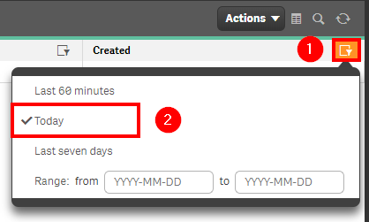
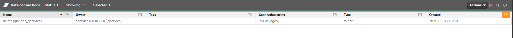

# Check for New Data Connections <i class="fas fa-dolly-flatbed fa-xs" title="Shipped | Native Capability"></i> <i class="fas fa-file-code fa-xs" title="API | Requires Script"></i>
{:.no_toc}

<span class="label prod">production</span>

|                                  		                  | Initial | Recurring |
|---------------------------------------------------------|---------|-----------|
| <i class="far fa-clock fa-sm"></i> **Estimated Time**   | 5 Min   | 5 min     |

Benefits:

  - Decrease redundancy
  - Increase awareness
  
-------------------------

## Goal
{:.no_toc}
Checking for new data connections on a regular basis is one of the ways to help curb the amount of connections that exist in your environment. It allows you to spot duplicates ahead of time, track what sources are being used, and catch any potential out-of-process additions. For a much deeper analysis of your data connections, please refer to the [Data Connection Analyzer](../../tooling/data_connection_analyzer.md).

## Table of Contents
{:.no_toc}

* TOC
{:toc}
-------------------------

## QMC - Data Connections <i class="fas fa-dolly-flatbed fa-xs" title="Shipped | Native Capability"></i>

In the QMC, select **Data Connections**:

[](https://raw.githubusercontent.com/qs-admin-guide/qs-admin-guide/master/docs/asset_management/data_connections/images/check_new_data_connections_native_1.png)

In the upper right hand side of the screen, select the **Column selector**, and then select the **Connection String**, **Type**, and **Created** columns.

[](https://raw.githubusercontent.com/qs-admin-guide/qs-admin-guide/master/docs/asset_management/data_connections/images/check_new_data_connections_native_2.png)

Now select the filter icon for the **Created** column, and then select the filter of **Today** (or **Last seven days** if you'd like a slightly larger rolling window).

[](https://raw.githubusercontent.com/qs-admin-guide/qs-admin-guide/master/docs/asset_management/data_connections/images/check_new_data_connections_native_3.png)

Lastly, you can review the resulting table and view any new data connections.

[](https://raw.githubusercontent.com/qs-admin-guide/qs-admin-guide/master/docs/asset_management/data_connections/images/check_new_data_connections_native_4.png)

-------------------------

## Get List of New Data Connections (Qlik CLI) <i class="fas fa-file-code fa-xs" title="API | Requires Script"></i>

The below script snippet requires the [Qlik CLI](../../tooling/qlik_cli.md).

The script will bring back any data connection with a **Created Date** that is greater than or equal to x days old. The script will then store the output into the location of your choice in either csv or json format.

### Script
```powershell
# Function to collect data connections that were created in the last x days

# Parameters
# Assumes default credentials are used for the Qlik CLI Connection
$computerName = '<machine-name>'
$virtualProxyPrefix = '/default' # leave empty if windows auth is on default VP
$daysBack = 7
$filePath = 'C:\'
$fileName = 'output'
$outputFormat = 'csv'

# Main
$outFile = ($filePath + $fileName + '.' + $outputFormat)
$date = (Get-Date -date $(Get-Date).AddDays(-$daysBack) -UFormat '+%Y-%m-%dT%H:%M:%S.000Z').ToString()
$computerNameFull = ($computerName + $virtualProxyPrefix).ToString()
Connect-Qlik -ComputerName $computerNameFull -UseDefaultCredentials -TrustAllCerts
$newDataConnections = Get-QlikDataConnection -filter "createdDate ge '$date'" -full

(&{If($outputFormat.ToLower() -eq 'csv') {$newDataConnections | ConvertTo-Csv -NoTypeInformation | Set-Content $outFile} Else {$newDataConnections | ConvertTo-Json | Set-Content $outFile}})
```

### Example Output
```
{
    "id":  "47693209-0b1a-4809-9346-d62677bbd997",
    "createdDate":  "2020/03/03 18:50",
    "modifiedDate":  "2020/03/03 18:50",
    "modifiedByUserName":  "QLIK-POC\\qservice",
    "customProperties":  [

                         ],
    "owner":  {
                  "id":  "4800913a-578e-4050-bf2e-e5074172ed05",
                  "userId":  "qservice",
                  "userDirectory":  "QLIK-POC",
                  "name":  "qservice",
                  "privileges":  null
              },
    "name":  "delete (qlik-poc_qservice)",
    "connectionstring":  "C:\\Packages\\",
    "type":  "folder",
    "engineObjectId":  "47693209-0b1a-4809-9346-d62677bbd997",
    "username":  "",
    "logOn":  "LOG_ON_SERVICE_USER",
    "architecture":  "Undefined",
    "tags":  null,
    "privileges":  null,
    "schemaPath":  "DataConnection"
}
```

**Tags**

#weekly
