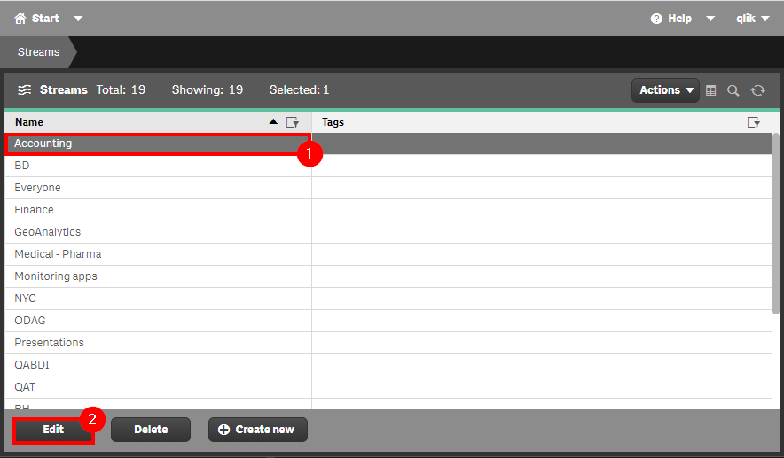

# Remove Unused Streams <i class="fas fa-dolly-flatbed fa-xs" title="Shipped | Native Capability"></i> <i class="fas fa-file-code fa-xs" title="API | Requires Script"></i>
{:.no_toc}

## Applicable Environments
{:.no_toc}
* All

## Goal
{:.no_toc}

Sometimes we move applications from one stream to another and, we do not notice that the stream is now empty. Or we create a stream waiting for applications get published to it and, they do not get published. It is always a good practice to delete unused Streams.

## Table of Contents
{:.no_toc}

* TOC
{:toc}

-------------------------

## QMC - Manually Check Published Apps For Each Stream  <i class="fas fa-dolly-flatbed fa-xs" title="Shipped | Native Capability"></i>

In the QMC, select **Streams**:

[](https://raw.githubusercontent.com/qs-admin-guide/qs-admin-guide/master/docs/asset_management/streams/images/remove_unused_stream_01.png)

You will now see all the **Streams**. To view all applications that were published to a specific Stream, select the Stream name and enter to edit mode.

[](https://raw.githubusercontent.com/qs-admin-guide/qs-admin-guide/master/docs/asset_management/streams/images/remove_unused_stream_02.png)

In **Edit** mode, select the **Apps** tab.

[](https://raw.githubusercontent.com/qs-admin-guide/qs-admin-guide/master/docs/asset_management/streams/images/remove_unused_stream_03.png)

You will now see applications that were published to this stream.

[](https://raw.githubusercontent.com/qs-admin-guide/qs-admin-guide/master/docs/asset_management/streams/images/remove_unused_stream_04.png)

This process should be repeated for each **Stream** to find unused streams.
In case you have a considerable quantity of streams, consider to use the [CLI method](#get-list-of-unused-streams-qlik-cli-).

-------------------------

## Get List of Unused Streams (Qlik CLI) <i class="fas fa-file-code fa-xs" title="API | Requires Script"></i>

The below script snippet requires the [Qlik CLI](../../tooling/qlik_cli.md).

The script will bring all streams and the number of applications inside of each one. The script will then store the output into the location of your choice in either csv or json format.

### Script
```powershell
# Script to find any empty streams

# Parameters
# Assumes default credentials are used for the Qlik CLI Connection
$computerName = 'machineName'
$virtualProxyPrefix = '/default' # leave empty if windows auth is on default VP
$filePath = 'C:\'
$fileName = 'output'
$outputFormat = 'json'

$outFile = ($filePath + $fileName + '.' + $outputFormat)
$computerNameFull = ($computerName + $virtualProxyPrefix).ToString()

# Main
Connect-Qlik -ComputerName $computerNameFull -UseDefaultCredentials -TrustAllCerts
$streamJson = Get-QlikStream -raw -full
$appStreamIds = Get-QlikApp -filter "published eq true" | foreach{$_.stream.id} | Sort-Object | Get-Unique
$emptyStreamIDs = ($streamJson | foreach{$_.id}) | ?{$appStreamIds -notcontains $_}
$streamEmptyJson = $streamJson | ?{$emptyStreamIDs -contains $_.id}

(&{If($emptyStreamIDs.length) {$("Empty Streams Found: " + $emptyStreamIDs.count) ; $streamEmptyJson} Else {"No Empty Streams Found"}})
If ($emptyStreamIDs.length) {
    (&{If($outputFormat.ToLower() -eq 'csv') {$streamEmptyJson | ConvertTo-Csv -NoTypeInformation | Set-Content $outFile} Else {$streamEmptyJson | ConvertTo-Json | Set-Content $outFile}})
}
```

### Example Output
```
[
    {
        "id":  "b4062a80-bf90-48ad-9328-12c945743f1e",
        "name":  "An Empty Stream",
        "privileges":  null
    },
    {
        "id":  "450e940c-13cd-48b7-bc19-2b1f51c8da22",
        "name":  "Another Empty Stream",
        "privileges":  null
    }
]
```

**Tags**

#monthly
