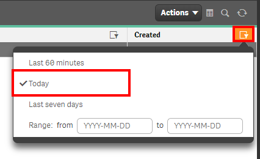
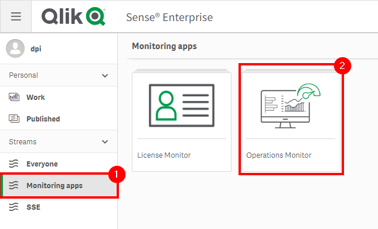
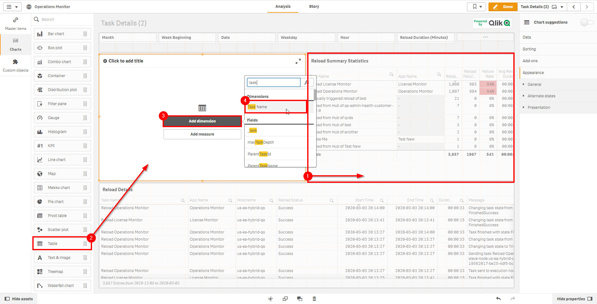

# Check for Tasks <i class="fas fa-dolly-flatbed fa-xs" title="Shipped | Native Capability"></i> <i class="fas fa-file-code fa-xs" title="API | Requires Script"></i>
{:.no_toc}

<span class="label prod">production</span>

|                                  		                      | Initial   | Recurring  |
|-----------------------------------------------------------|-----------|------------|
| <i class="far fa-clock fa-sm"></i> **Estimated Time**     | 2 min     | 2 min      |

Benefits:

  - Increase awareness
  - Increase reaction times
  
-------------------------

## Goal
{:.no_toc}
Checking for new tasks regularly helps not only to curate what is necessary (cadence, duplicates, etc), but also allows for you to review your batch window, task concurrencies, and any implications against the Qlik schedulers. The above may influence architectural patterns and dictate the need for reload task pinning.

## Table of Contents
{:.no_toc}

* TOC
{:toc}
-------------------------

## QMC - Tasks <i class="fas fa-dolly-flatbed fa-xs" title="Shipped | Native Capability"></i>

In the QMC, select **Tasks**:

[](https://raw.githubusercontent.com/qs-admin-guide/qs-admin-guide/master/docs/asset_management/tasks/images/check_tasks_native_1.png)

In the upper right hand side of the screen, select the **Column selector**, and then select the **Created** column.

[](https://raw.githubusercontent.com/qs-admin-guide/qs-admin-guide/master/docs/asset_management/tasks/images/check_tasks_native_2.png)

Now select the filter icon for the **Created** column, and then select the filter of **Today** (or **Last seven days** if you'd like a slightly larger rolling window).

[](https://raw.githubusercontent.com/qs-admin-guide/qs-admin-guide/master/docs/asset_management/tasks/images/check_tasks_native_3.png)

Lastly, you can review the resulting table and view any new tasks.

[](https://raw.githubusercontent.com/qs-admin-guide/qs-admin-guide/master/docs/asset_management/tasks/images/check_tasks_native_4.png)

-------------------------

## Hub - Operations Monitor <i class="fas fa-dolly-flatbed fa-xs" title="Shipped | Native Capability"></i>

Open up the Hub and navigate to your **Monitoring apps** stream. Select the **Operations Monitor** application.

[](https://raw.githubusercontent.com/qs-admin-guide/qs-admin-guide/master/docs/asset_management/tasks/images/check_tasks_native_1_1.png)

From the **App overview** page, select the **Task Details** sheet.

[](https://raw.githubusercontent.com/qs-admin-guide/qs-admin-guide/master/docs/asset_management/tasks/images/check_tasks_native_1_2.png)

Select **Duplicate**, as we are going to add a column that isn't currently in a table.

[](https://raw.githubusercontent.com/qs-admin-guide/qs-admin-guide/master/docs/asset_management/tasks/images/check_tasks_native_1_3.png)

In **Edit** mode, select the **Reload Summary Statistics** table and shrink it to allow for more real estate, as we will be adding another table.

Drag in a new table object, and add the dimension of **Task Name**.

[](https://raw.githubusercontent.com/qs-admin-guide/qs-admin-guide/master/docs/asset_management/tasks/images/check_tasks_native_1_4.png)

Now we also need to add the **Task Created** dimension to that table. Note that reloads from the Hub and manual reloads will not show a created date.

[](https://raw.githubusercontent.com/qs-admin-guide/qs-admin-guide/master/docs/asset_management/tasks/images/check_tasks_native_1_5.png)

You can now sort by that **Task Created** column to view new tasks.

[](https://raw.githubusercontent.com/qs-admin-guide/qs-admin-guide/master/docs/asset_management/tasks/images/check_tasks_native_1_6.png)

For deeper analysis into tasks, refer to [Analyze Tasks](analyze_tasks.md)


-------------------------

## Get List of New Tasks (Qlik CLI) <i class="fas fa-file-code fa-xs" title="API | Requires Script"></i>

The below script snippet requires the [Qlik CLI](../../tooling/qlik_cli.md).

The script will bring back any reload tasks with a **Created Date** that is greater than or equal to x days old. The script will then store the output into the location of your choice in either csv or json format.

### Script
```powershell
# Function to collect reload tasks that were created in the last x days

# Parameters
# Assumes default credentials are used for the Qlik CLI Connection
$computerName = 'machineName'
$virtualProxyPrefix = '/default' # leave empty if windows auth is on default VP
$daysBack = 1
$filePath = 'C:\'
$fileName = 'output'
$outputFormat = 'json'

$outFile = ($filePath + $fileName + '.' + $outputFormat)
$date = (Get-Date -date $(Get-Date).AddDays(-$daysBack) -UFormat '+%Y-%m-%dT%H:%M:%S.000Z').ToString()
$computerNameFull = ($computerName + $virtualProxyPrefix).ToString()

# Main
Connect-Qlik -ComputerName $computerNameFull -UseDefaultCredentials -TrustAllCerts

If ($outputFormat.ToLower() -eq 'csv') {
  Get-QlikReloadTask -filter "createdDate ge '$date'" -full | ConvertTo-Csv -NoTypeInformation | Set-Content $outFile
  }  Else {
  Get-QlikReloadTask -filter "createdDate ge '$date'" -full | ConvertTo-Json | Set-Content $outFile
}
```

### Example Output
```
{
    "id":  "16c2f8d0-7d46-4c79-8ab6-6a75f90a38a9",
    "createdDate":  "2020/03/03 19:40",
    "modifiedDate":  "2020/03/03 19:40",
    "modifiedByUserName":  "QLIK-POC\\dpi",
    "customProperties":  [

                         ],
    "app":  {
                "id":  "9625626c-71bb-4062-a00d-6406c7829ac5",
                "name":  "Test New",
                "appId":  "",
                "publishTime":  "1753/01/01 00:00",
                "published":  false,
                "stream":  null,
                "savedInProductVersion":  "12.475.3",
                "migrationHash":  "21ecc792c56e18162f1785d3d41f28fdaced5c96",
                "availabilityStatus":  "NotApplicable",
                "privileges":  null
            },
    "isManuallyTriggered":  false,
    "operational":  {
                        "id":  "56e8e612-8bbc-42db-bde0-b4173210d15d",
                        "lastExecutionResult":  {
                                                    "id":  "17f49de9-dfc6-4c4c-aa04-bdf39d10bd87",
                                                    "executingNodeName":  "us-ea-hybrid-qs",
                                                    "status":  "FinishedSuccess",
                                                    "startTime":  "2020/03/03 19:45",
                                                    "stopTime":  "2020/03/03 19:45",
                                                    "duration":  1428,
                                                    "fileReferenceID":  "dcc50f73-7957-4371-8f32-6a275922f58e",
                                                    "scriptLogAvailable":  false,
                                                    "details":  "    ",
                                                    "scriptLogLocation":  "us-ea-hybrid-qs\\Script\\9625626c-71bb-4062-a00d-6406c7829ac5.20200303T194515.553+0000.F5AFCAF853712D5B7DBC.log",
                                                    "scriptLogSize":  6964,
                                                    "privileges":  null
                                                },
                        "nextExecution":  "2020/03/04 19:45",
                        "privileges":  null
                    },
    "name":  "Delete Me",
    "taskType":  "Reload",
    "enabled":  true,
    "taskSessionTimeout":  1440,
    "maxRetries":  0,
    "tags":  null,
    "privileges":  null,
    "schemaPath":  "ReloadTask"
}
```

**Tags**

#weekly

