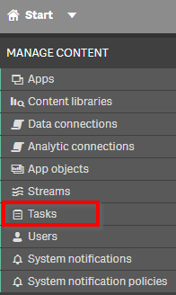
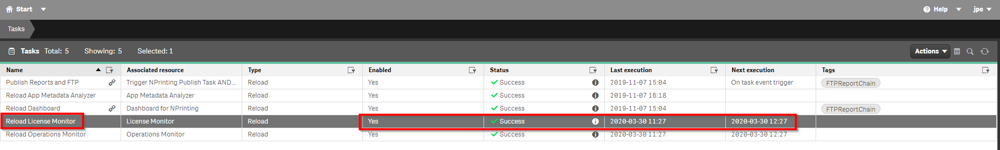
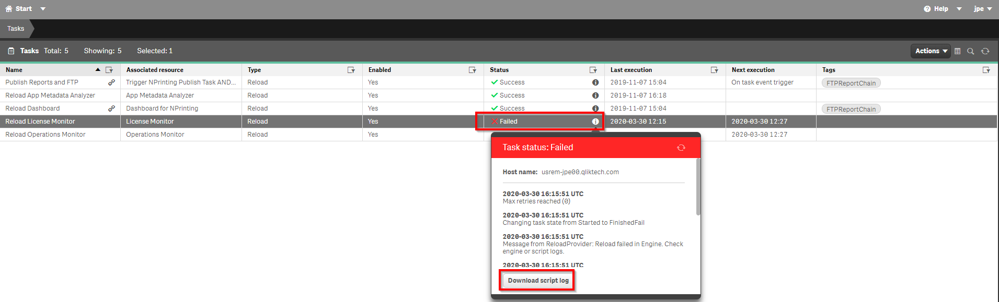
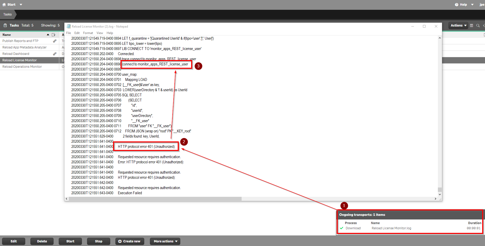

# License Allocation <i class="fas fa-tools fa-xs" title="Tooling | Pre-Built Solutions"></i> <i class="fas fa-dolly-flatbed fa-xs" title="Shipped | Native Capability"></i> 
{:.no_toc}

## Applicable Environments 
{:.no_toc}
- All

## Goal
{:.no_toc}
The goal of this activity is to evaluate license growth and needs using the built in "License Monitor" application. At the same time, Qlik Sense administrators should check to ensure its working and collecting usage data. 

## Table of Contents
{:.no_toc}

* TOC
{:toc}
-------------------------

### Check License Monitor Status <i class="fas fa-dolly-flatbed fa-xs" title="Shipped | Native Capability"></i> 

In the QMC, select **Tasks**:

Find the "Reload License Monitor" Task and check if the status is "Success"

If the status is "Failed" then download the script log to see where it might be failing

Also consult help.qlik.com for assistance in configuring the monitoring tools

