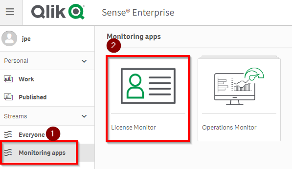
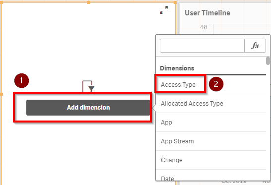

# License Allocation <i class="fas fa-tools fa-xs" title="Tooling | Pre-Built Solutions"></i> <i class="fas fa-dolly-flatbed fa-xs" title="Shipped | Native Capability"></i> 
{:.no_toc}

## Applicable Environments 
{:.no_toc}
- All

## Goal
{:.no_toc}
The goal of this activity is to evaluate license growth and needs using the built in "License Monitor" application. At the same time, Qlik Sense administrators should check to ensure its working and collecting usage data. 

## Table of Contents
{:.no_toc}

* TOC
{:toc}
-------------------------

### Check License Monitor Status <i class="fas fa-dolly-flatbed fa-xs" title="Shipped | Native Capability"></i> 

In the HUB, go to the "Monitoring Apps" stream and select the "License Monitor" App to open it

From App Overview, select the "Overview" sheet

Check the 'reload date' to see if the License Monitor has refreshed today

If the date is old , then you may be missing the latest license usage data. Skip to "debugging the License Monitor" below. 

If the data is within the last 24 hours then skip ahead to 'Analyzing the License Data' 

### Debugging the License Monitor <i class="fas fa-dolly-flatbed fa-xs" title="Shipped | Native Capability"></i> 

In the QMC, select **Tasks**:

Find the "Reload License Monitor" Task and check if the status is "Failed". 

If you did not find the reload license monitor then either its been renamed or deleted. Simply recreate a new reload task. The default interval to refresh is every hour, but it can also be run less frequently. 

If the status is "Failed" then download the script log to see where it might be failing

SAMPLE error :  in the following example the script log shows a 401 error where a required data connection had the wrong credentials

Also consult help.qlik.com for assistance in configuring the monitoring tools

https://help.qlik.com/en-US/sense-admin/February2020/Subsystems/DeployAdministerQSE/Content/Sense_DeployAdminister/QSEoW/Administer_QSEoW/Monitoring_QSEoW/Configure-monitoring-apps.htm

### Analyze License Data <i class="fas fa-dolly-flatbed fa-xs" title="Shipped | Native Capability"></i> 

First check the QMC to see how many total license are available for Professional and Analyzers. Go to the 'License Management' Section of the QMC. 

Ensure 'License Usage Summary' is selected on the right , and then check the total licenses on the left for both Professional and Analyzers

Next, go to the 'Monitoring Apps' section of the QMC

And select the 'License Monitor'

Go to the 'Overview' sheet of the Qlik Sense "License Monitor" app

And select the 'License Monitor'

Click the 'Duplicate' Button on the toolbar

Edit the 'User Timeline' Chart by selecting it and deleting the 'Access Type' Measure

With 'Access Type' removed, open the 'Measures' and select 'Add Trend' under 'User Accessing Apps'

Select 'Linear' as the Trend Type

Move the 'Allocation Changed in 7 days' table to the left and add a Filter Pane in the empty space to the left of the alterered 'User Timeline' chart

Select 'Dimension' and choose 'Access Type'

Now click 'Done' at the top 

Select 'Analyzer' in the filter pane and view/analyze the growth rate in Analyzer app usage. To do this, grab two points on the chart that intersect with Y axis grid lines. In the sample below these two values are '20' and '30' respectively. Since the two points are 4 months apart , we can deduce that the linear growth rate is approximately 2.5 new analyzers per month. 

Repeart for 'Professional'. In this sample, the growth line is flat. 

