# Optimize License Allocation <i class="fas fa-tools fa-xs" title="Tooling | Pre-Built Solutions"></i> <i class="fas fa-dolly-flatbed fa-xs" title="Shipped | Native Capability"></i> 
{:.no_toc}

## Applicable Environments 
{:.no_toc}
- All

## Goal
{:.no_toc}
The goal of this activity is to evaluate license growth and needs using the built in "License Monitor" application. At the same time, Qlik Sense administrators should check to ensure its working and collecting usage data. 

There are a three recommendations that license allocations can be monitored and optimized. 

These are:

1 - Removing license allocations for users that have left the organization
2 - Removing license allocations for users that have not recently logged in or have never logged in
3 - Downgrading Professional allocations to Analyzer allocations for users who are not exercising their 'professional' capabilities

## Table of Contents
{:.no_toc}

* TOC
{:toc}
-------------------------

### 1 - Removing license allocations for users that have left the organization  <i class="fas fa-dolly-flatbed fa-xs" title="Shipped | Native Capability"></i> 

To get a list of current allocations, go to the HUB , select the "Monitoring apps" stream and select the "License monitor" application

From the 'App Overview' select 'New Sheet' 

[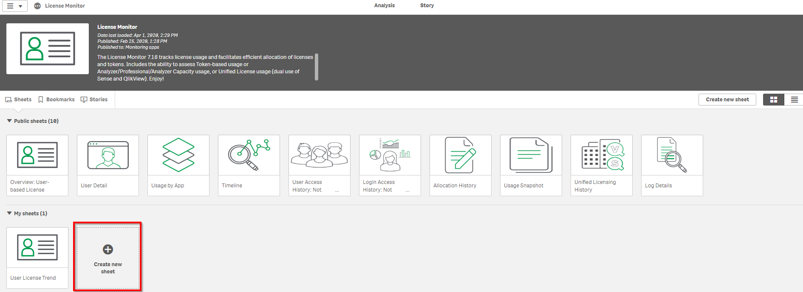](https://raw.githubusercontent.com/qs-admin-guide/qs-admin-
guide/master/docs/license/images/Optimize_License_Allocations_HUB_License_Monitor_App_Overview_NewSheet.png)

Give the new sheet a title of "Current License Allocations"

[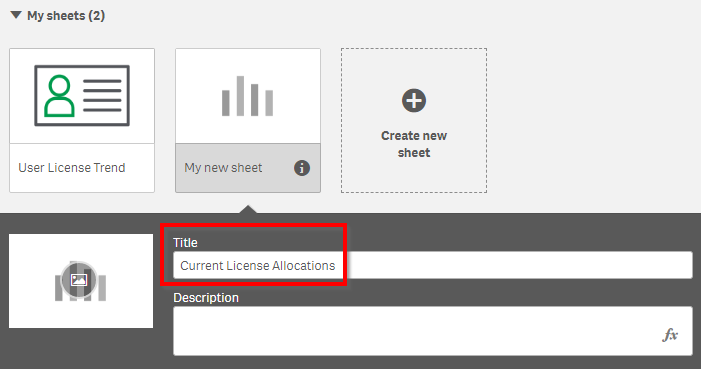](https://raw.githubusercontent.com/qs-admin-guide/qs-admin-
guide/master/docs/license/images/Optimize_License_Allocations_HUB_License_Monitor_App_Overview_NewSheet_Title.png)

Click on the 'Current License Allocations' new sheet and then click the 'Edit' button on the toolbar

[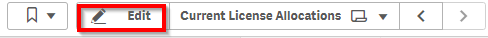](https://raw.githubusercontent.com/qs-admin-guide/qs-admin-
guide/master/docs/license/images/Optimize_License_Allocations_HUB_License_Monitor_EditSheet.png)

Add a table from the chart library onto the empty sheet

Click the 'Add Dimension' button 

Select 'User ID'

Next, on the right side, under 'Dimensions' select 'Add Column' and choose 'Allocated Access Type'

Uncheck 'Include Null Values'

Next, on the right, click 'Sorting' and drag the 2nd column 'Allocated Access Type' above the 1st column 'User ID'. This will group the table by 'Allocated Access Type'

A sample result is as follows.  You can make additional changes as you see fit to make it clear which userIDs have an allocated access type.

Click 'Done' on the toolbar
 
[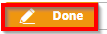](https://raw.githubusercontent.com/qs-admin-guide/qs-admin-
guide/master/docs/license/images/Optimize_License_Allocations_HUB_License_Monitor_Done.png)

The sample final result is as follows:

[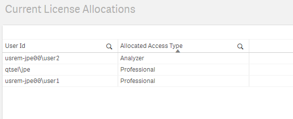](https://raw.githubusercontent.com/qs-admin-guide/qs-admin-
guide/master/docs/license/images/Optimize_License_Allocations_HUB_License_Monitor_CurrentLicenseAllocationsCOMPLETE.png)

### 2 - Removing license allocations for users that have not recently logged in or have never logged in  <i class="fas fa-dolly-flatbed fa-xs" title="Shipped | Native Capability"></i> 

We can re-use the Qlik Sense "License Monitor' monitoring application for this need by duplicating and customizing the 'UserDetail' sheet.

Go to the HUB , select the 'Monitoring Apps' stream and open the License Monitor 

Select the 'User Detail' sheet

[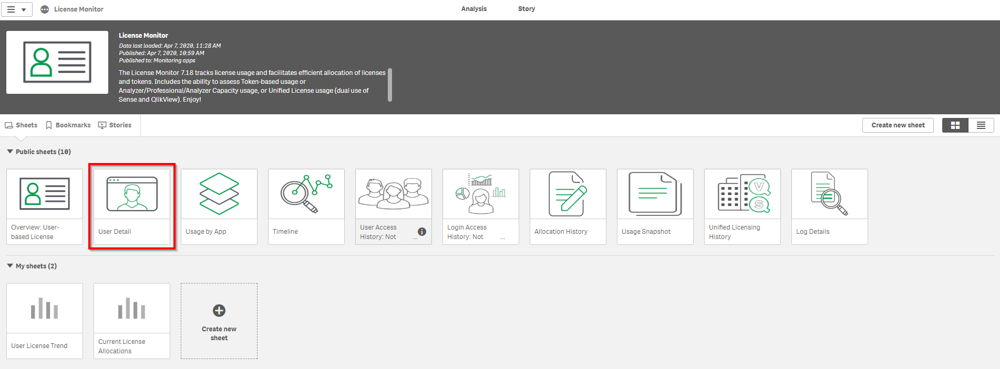](https://raw.githubusercontent.com/qs-admin-guide/qs-admin-
guide/master/docs/license/images/Optimize_License_Allocations_HUB_License_Monitor_Open_UserDetail_Sheet.png)

Press 'Duplicate' in the top right corner to make a copy of the sheet.  We can customize the copy to our needs

[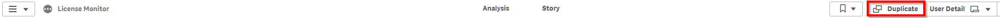](https://raw.githubusercontent.com/qs-admin-guide/qs-admin-
guide/master/docs/license/images/Optimize_License_Allocations_HUB_License_Monitor_UserDetail_Sheet_Duplicate.png)

Delete the highlighted objects below from the copied sheet

[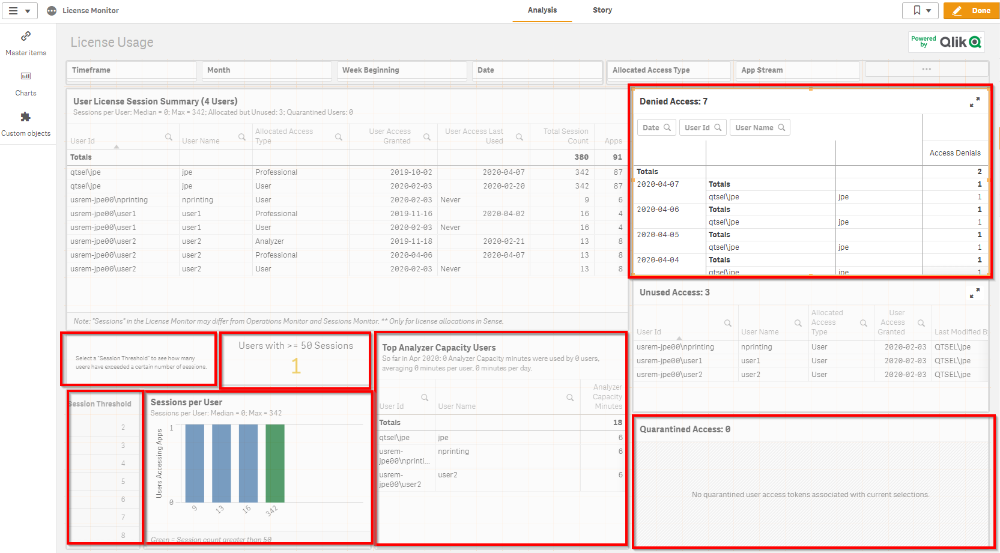](https://raw.githubusercontent.com/qs-admin-guide/qs-admin-
guide/master/docs/license/images/Optimize_License_Allocations_HUB_License_Monitor_UserDetail_Sheet_Duplicate_DeleteObjects.png)

Then resize the 'User License Session Summary' object and the 'Unused Access' object as follows. Also, drag a 'Filter Pane' object onto the left side of the sheet

[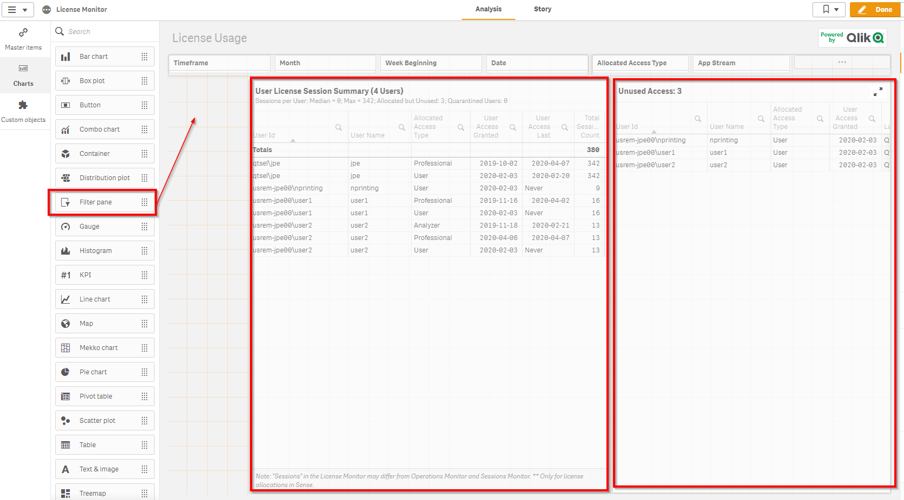](https://raw.githubusercontent.com/qs-admin-guide/qs-admin-
guide/master/docs/license/images/Optimize_License_Allocations_HUB_License_Monitor_UserDetail_Sheet_Duplicate_ResizeObjects_AddFilterPane.png)

Click 'Add Dimension'

[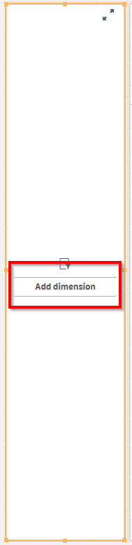](https://raw.githubusercontent.com/qs-admin-guide/qs-admin-
guide/master/docs/license/images/Optimize_License_Allocations_HUB_License_Monitor_UserDetail_Sheet_Duplicate_ResizeObjects_AddFilterPane_AddDimension.png)

Type in 'User Access Last Used' and select 'User Access Last Used' 

[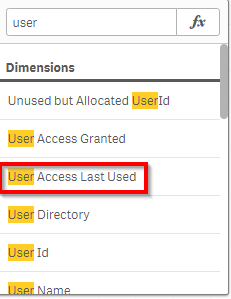](https://raw.githubusercontent.com/qs-admin-guide/qs-admin-
guide/master/docs/license/images/Optimize_License_Allocations_HUB_License_Monitor_UserDetail_Sheet_Duplicate_ResizeObjects_AddFilterPane_AddDimension_UserAccessLastUsed.png)

As shown below, click in an unused area at the top of the sheet to select the sheet, and then enter 'Inactive License Allocations' for the sheet title

[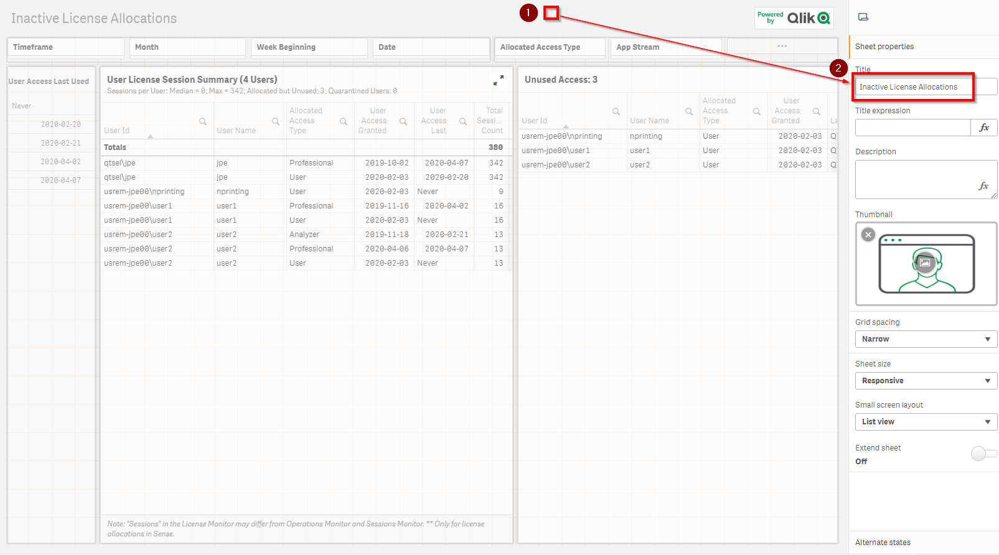](https://raw.githubusercontent.com/qs-admin-guide/qs-admin-
guide/master/docs/license/images/Optimize_License_Allocations_HUB_License_Monitor_InactiveLicenseAllocations.png)

Select the 'Done' button at the top 

[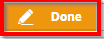](https://raw.githubusercontent.com/qs-admin-guide/qs-admin-
guide/master/docs/license/images/Optimize_License_Allocations_HUB_License_Monitor_InactiveLicenseAllocations_DONE.png)

The 'Unused License Allocations' will show a list of users who have never logged in . These are candidates for license allocation removal.

[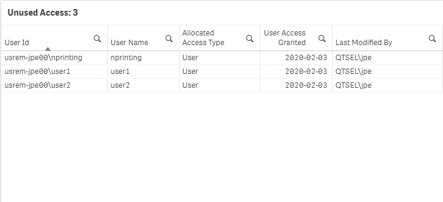](https://raw.githubusercontent.com/qs-admin-guide/qs-admin-
guide/master/docs/license/images/Optimize_License_Allocations_HUB_License_Monitor_InactiveLicenseAllocations_UnusedLicenseAllocations.png)

Use the 'User Access Last Used' filter pane to select old dates . This will filter the 'User License Session Summary' to show users that last logged in some time ago. Pick dates the represent > 6 months ago or > 1 year ago to see whose become inactive. Users that last logged in some time ago are candidates for license allocation removal

[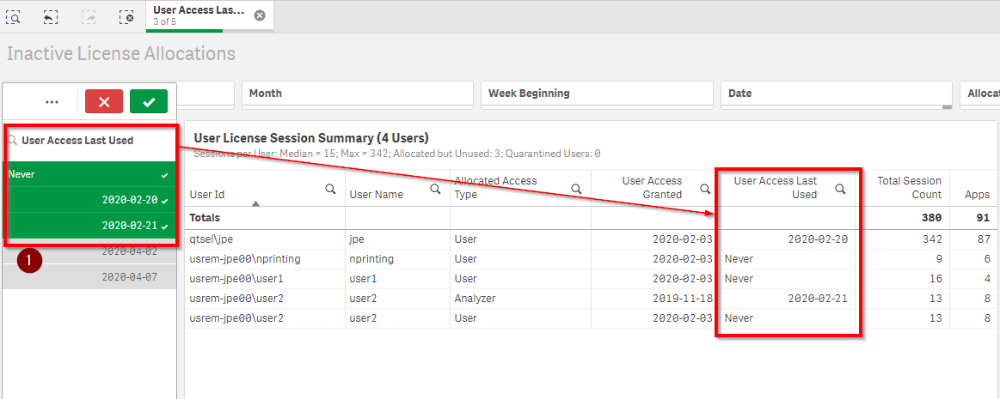](https://raw.githubusercontent.com/qs-admin-guide/qs-admin-
guide/master/docs/license/images/Optimize_License_Allocations_HUB_License_Monitor_InactiveLicenseAllocations_LastUsedLicenseAllocations.png)

### 3 - Downgrading Professional allocations to Analyzer allocations for users who are not exercising their 'professional' capabilities  <i class="fas fa-dolly-flatbed fa-xs" title="Shipped | Native Capability"></i> 

In this section, we import a customized Qlik Sense application that we can reload to reveal which users who have a 'Professional' license allocation that are not currently leveraging the 'Professional' capabilities. 

From the QMC, select 'Apps' 

[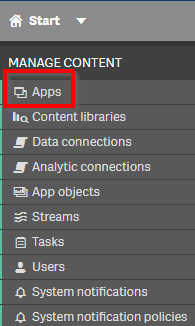](https://raw.githubusercontent.com/qs-admin-guide/qs-admin-
guide/master/docs/license/images/Optimize_License_Allocations_QMC_Start_Apps.png)

Select the 'Import' button at the bottom of the page

[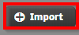](https://raw.githubusercontent.com/qs-admin-guide/qs-admin-
guide/master/docs/license/images/Optimize_License_Allocations_QMC_Start_Apps_Import.png)

Browse to the 'License Optimization' app and select 'Open'

[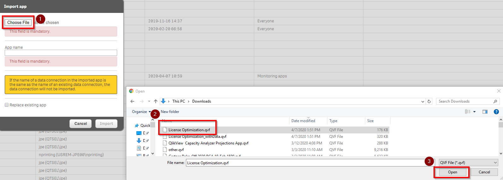](https://raw.githubusercontent.com/qs-admin-guide/qs-admin-
guide/master/docs/license/images/Optimize_License_Allocations_QMC_Start_Apps_Import_LicenseOptimization.png)

Select 'Import'

[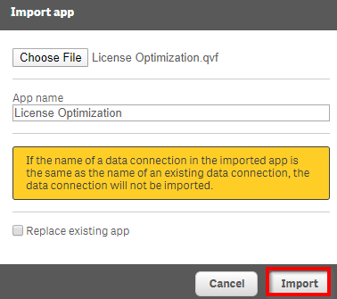](https://raw.githubusercontent.com/qs-admin-guide/qs-admin-
guide/master/docs/license/images/Optimize_License_Allocations_QMC_Start_Apps_Import_LicenseOptimization_Import.png)

Go to the HUB and open the 'License Optimization' app from 'My Work'

[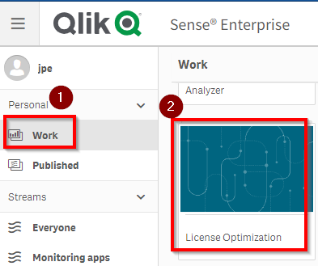](https://raw.githubusercontent.com/qs-admin-guide/qs-admin-
guide/master/docs/license/images/Optimize_License_Allocations_HUB_Open_LicenseOptimization.png)

From the Compass button menu in the top left, select 'Data Load Editor'

[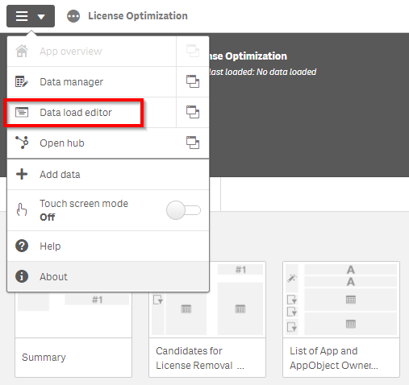](https://raw.githubusercontent.com/qs-admin-guide/qs-admin-
guide/master/docs/license/images/Optimize_License_Allocations_HUB_LicenseOptimization_DLE.png)

Once the data load editor loads, ensure you have read access to use the following built in Qlik Sense REST Connections from the hub. You may need to add a security rule in the QMC to provide explicit access from the HUB ( by default, access is only granted from the QMC)

[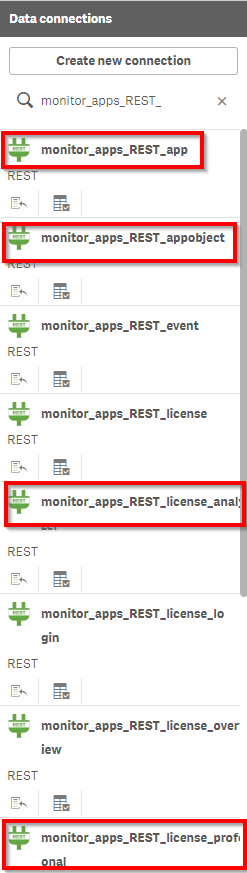](https://raw.githubusercontent.com/qs-admin-guide/qs-admin-
guide/master/docs/license/images/Optimize_License_Allocations_HUB_LicenseOptimization_DataConnections.png)

Have you deployed ODAG (OnDemand App Generation) in this environment ?  

If YES, then enter a comma delimitted list of App IDs of the ODAG Template Apps in the environment.  The License Optimization will recommend downgrading a Professional to Analyzer if the only content the professional owns is a ODAG detailed app copied from the template. This is because ODAG can be initiated by Analyzer users.

If NO, please skip this step and go to the next step

Select 'Load Data' in the top right

[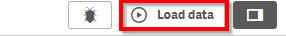](https://raw.githubusercontent.com/qs-admin-guide/qs-admin-
guide/master/docs/license/images/Optimize_License_Allocations_HUB_LicenseOptimization_LoadData.png)

Once the app reloads, select 'Analysis' at the top

[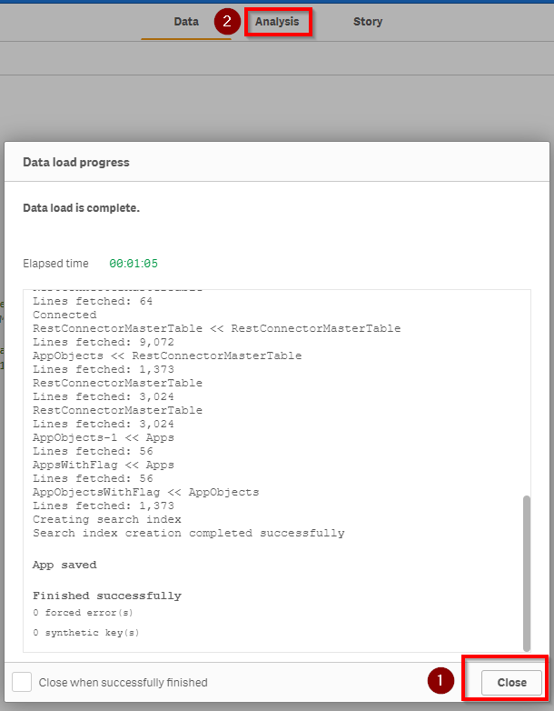](https://raw.githubusercontent.com/qs-admin-guide/qs-admin-
guide/master/docs/license/images/Optimize_License_Allocations_HUB_LicenseOptimization_Analysis.png)

The summary sheet opens first.  It counts and highlights users with license allocations that have 

1) Never logged in
2) Logged in at the 

[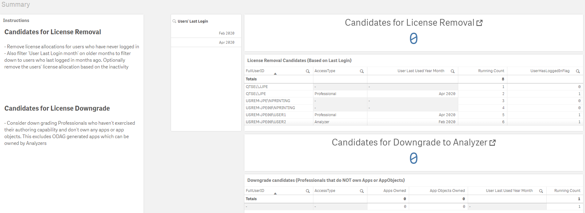](https://raw.githubusercontent.com/qs-admin-guide/qs-admin-
guide/master/docs/license/images/Optimize_License_Allocations_HUB_LicenseOptimization_Summary.png)

