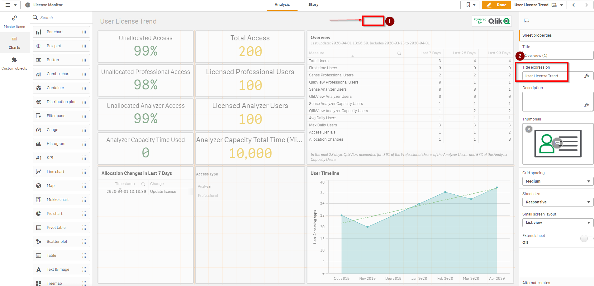

# Optimize License Allocation <i class="fas fa-tools fa-xs" title="Tooling | Pre-Built Solutions"></i> <i class="fas fa-dolly-flatbed fa-xs" title="Shipped | Native Capability"></i> 
{:.no_toc}

## Applicable Environments 
{:.no_toc}
- All

## Goal
{:.no_toc}
The goal of this activity is to evaluate license growth and needs using the built in "License Monitor" application. At the same time, Qlik Sense administrators should check to ensure its working and collecting usage data. 

## Table of Contents
{:.no_toc}

* TOC
{:toc}
-------------------------

### Remove license allocations for users that have left the organization or will no longer need access

To get a list of current allocations, go to the HUB , select the "Monitoring apps" stream and select the "License monitor" application

 the organization or no longer need access <i class="fas fa-dolly-flatbed fa-xs" title="Shipped | Native Capability"></i> 

