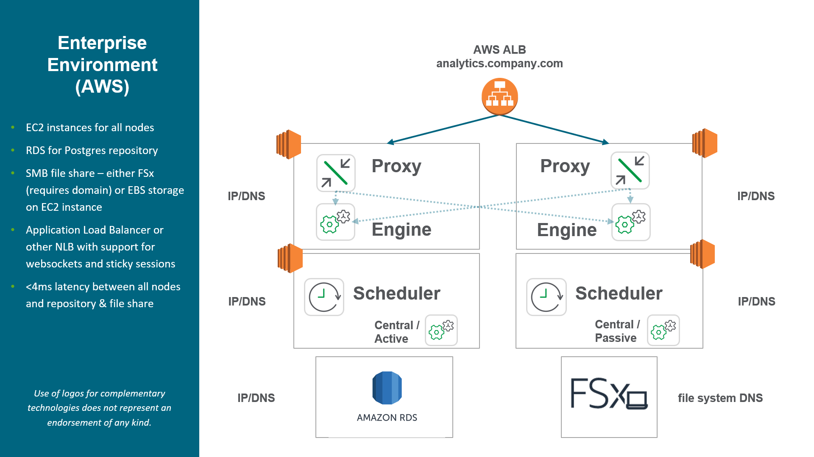
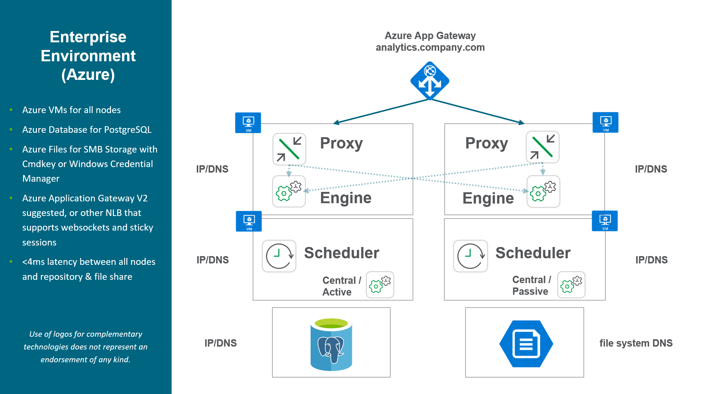

# Review Architecture/Scale Plan
{: .no_toc }

## Applicable Environments
{:.no_toc}

- Production 

## Goal
{:.no_toc}

The goal is to have documented Qlik architecture diagrams of n and n+1 deployments*, as well as an understanding of high-level architectural concepts within Qlik.

This is integral for:

- understanding the deployment and how it is laid out

- planning for growth

- articulating change

- understanding resiliency & availability

- having documentation available to others

\* n refers to the current deployment, while n+1 refers to an anticpated state of the next deployment.

-------------------------

## Table of Contents
{:.no_toc}

* TOC
{:toc}

-------------------------

## Building an Architecture Diagram

### Core Requirements
- An editor. This could be Visio, PowerPoint, or web editors like [Gliffy](https://gliffy.com) and [Draw.io](https://draw.io).

- A set of base icons or symbols

  - If the deployment is on-premises
  
    - a server
        
    - a database
        
    - a file share
        
    - a network load balancer
    
  - If the deployment is in the cloud:
  
    - AWS icons can be found [here](https://aws.amazon.com/architecture/icons/)
    
    - Azure icons can be found [here](https://www.microsoft.com/en-us/download/details.aspx?id=41937)
    
    - GCP icons can be found [here](https://cloud.google.com/icons)
    
- Knowledge of what Qlik services are active on what nodes

- Knowledge of what each Qlik node is being used for

- Knowledge of where the Qlik file share is and the Qlik respository database is

**Nice to Haves**

- Server names and aliases

- Any network load balancers/interfaces in front of Qlik

- Any firewall settings pertinent to Qlik

### Example Diagrams

#### On-Premsises

#### AWS

\* Please note that these cloud diagrams are intended for Qlik admins and occasionaly used to translate needs to supporting LOBs like IT. The examples below do not conform to the individual cloud vendor architectural diagram standards, as these aren't designed to be consumed by cloud engineers/network admins, etc. If one would like to include VPCs, AZs, SGs, Network ACLs, all the better -- however it goes beyond the basics of this exercise.

#### Azure

\* Please note that these cloud diagrams are intended for Qlik admins and occasionaly used to translate needs to supporting LOBs like IT. The examples below do not conform to the individual cloud vendor architectural diagram standards, as these aren't designed to be consumed by cloud engineers/network admins, etc. If one would like to include Virtual Networks, Subnets, Resource Groups, etc, all the better -- however it goes beyond the basics of this exercise.

-------------------------

## Planning for N+1 Architectures

-------------------------

## Resiliency & High Availability

When speaking about resiliency and high availability within the context of Qlik architecture, there are three tiers to focus on:

1. Proxy/Engine Resiliency (consumption)
  - Requires 2+ Qlik proxy/engine nodes
  - Requires third-party network load balancer
  
2. Scheduler Resiliency (reloads)
  - Requires 2+ Qlik scheduler nodes
  
3. Site-wide High Availability
  - Requires both 1 and 2 from above
  - Requires decoupled repository database and decoupled file share
    - The repository database can be stream replicated or clustered for resiliency
    - The file share must be resilient
  - Requires 2+ Qlik nodes with all services enabled, with 1+ nominated as failover candidates
  

For information regarding the persistence layer (repository database and file share), please refer to [Persistence](https://help.qlik.com/en-US/sense-admin/Subsystems/DeployAdministerQSE/Content/Sense_DeployAdminister/QSEoW/Deploy_QSEoW/Persistence.htm).

-------------------------

## High-level Scaling Concepts

Broadly speaking, there are two primary scaling methodologies -- however, do note that these are not mutually exclusive:

1. Horizontal Scaling
  - Adding additional nodes/services, providing a wide, resilient topology.
  
2. Vertical Scaling
  - Expanding current server footprints, i.e. adding additional cores/RAM.

Horizontal scaling is typically common if a Qlik environment has small to medium sized applications with many users. Meaning, applications can be loaded quickly onto many different engines with little delay, and calculations are fast -- meaning that a shared cache isn't necessarily as integral for these applications. This methodology is also common in virtual environments on-premsises where VM sizes may be restricted. For instance, if an organization caps VM sizes at 96 or 128 GB of RAM, more than likely that Qlik environment will end up with a wider footprint, and will adopt practices to allow their applications to fit it.

Vertical scaling is typically common where the user base is not extensive, and the applications are quite large. Less nodes with larger capacity allows for larger applications with more users taking advantage of the same cache. These applications are usually [cache warmed](../tooling_appendix/cache_warming.md) so that they are readily available for users without delay.

Both of these methodologies are frequently combined when an organization has a mix of both very large apps and smaller apps with a wide user pool. It is usually common for organizations to have "small - medium app engines" and "large app engines" -- for example, maybe four of the former and two of the latter. Leveraging load balancing rules (as described above), large applications are "pinned" to the larger nodes, and vice versa.

-------------------------

## Example Production Architectures

For additional documentation and examples, please refer to [Qlik Sense Enterprise on Windows: multi-node deployment](https://help.qlik.com/en-US/sense-admin/February2020/Subsystems/DeployAdministerQSE/Content/Sense_DeployAdminister/QSEoW/Deploy_QSEoW/Enterprise-deployment.htm).

