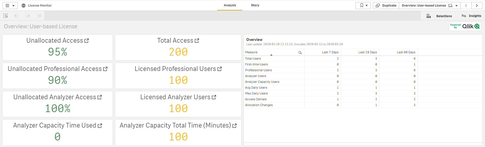

# Capacity Plan: Licenses <i class="fas fa-dolly-flatbed fa-xs" title="Shipped | Native Capability"></i>
{:.no_toc}

## Applicable Environments
{:.no_toc}
- Prod

# Goal
{:.no_toc}

The goal of this exercise is to identify license usage across your production site. The **License Monitor** application exposes this information simply, so that it can be easily referenced.

## Table of Contents
{:.no_toc}

* TOC
{:toc}

-------------------------

## License Monitor

Please refer to the [License Monitor](../../tooling/license_monitor.md) page for an overview and relevant documentation links.

-------------------------

## License Usage

Navigate to the **Monitoring apps** stream and open up the **License Monitor** application.

First and foremost, it is essential to confirm that the **License Monitor** is operational and up to date. Ensure that it is by selecting the _Show app information_ button, and then viewing the _Data last loaded_ section of the application's description.

Following, select the _Overview: xxxxx_ sheet. This sheet's title will vary based on the license model that is in place on the Qlik site.

Lastly, review the high-level license usage metrics found on the sheet.

