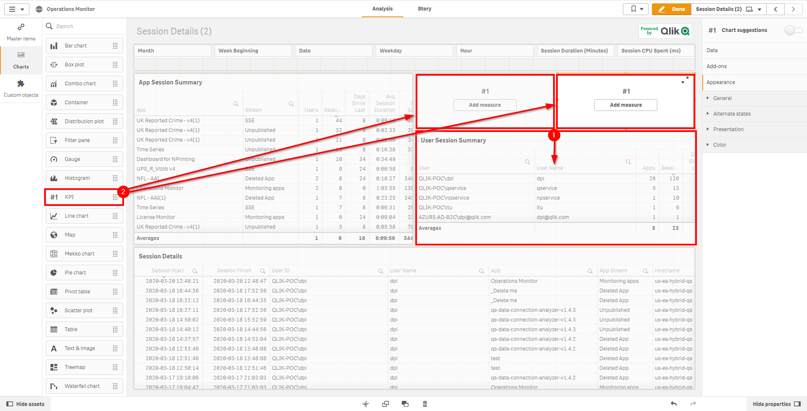

# Capacity Plan: Users <i class="fas fa-dolly-flatbed fa-xs" title="Shipped | Native Capability"></i>
{:.no_toc}

## Applicable Environments
{:.no_toc}
- Prod

# Goal
{:.no_toc}

The goal of this exercise is to identify user activity over a period of time since this exercise was last ran to identify variances in usage and anticipate future growth.

## Table of Contents
{:.no_toc}

* TOC
{:toc}

-------------------------

## Operations Monitor

Please refer to the [Operations Monitor](../../tooling/operations_monitor.md) page for an overview and relevant documentation links.

-------------------------

## User Activity

Navigate to the **Monitoring apps** stream and open up the **Operations Monitor** application.

First and foremost, it is essential to confirm that the **Operations Monitor** is operational and up to date. Ensure that it is by selecting the _Show app information_ button, and then viewing the _Data last loaded_ section of the application's description.

Following, select the _Session Details_ sheet.

Next, be sure to review the _App Session Summary_ object as well as the _User Session Summary_ objects as they display valuable information, such as how many individual sessions users have had, and against what applications. These are very useful metrics both for overall user usage and adoption.

That being said, we want to add two additional metrics that are not available by default on the sheet, as we are interested in:

  - The total number of distinct users that have had at least _1_ session over the last _x_ days
  - The total number of distinct users that have had _5_ or more sessions over the last _x_ days
  
These two metrics will help to identify and bucket how many active and semi-active users exist in the environment, and then will help with a license optimization exercise, which can be found here: [Optimize License Allocations](../../licensing/optimize_license_allocations.md).

To add these two metrics, start by duplicating the sheet.

Following, find space for two KPI objects. For example, shrink down the _User Session Summary_ table, and insert two KPI objects above it.

Next, select the first KPI and add the measure:

`Count({<[User Name]={"=Sum([Session Count])>0"}>}DISTINCT [User Name])`

Name this KPI: _Active Users: 1+ Sessions_

Next, repeat the process above for adding the following expression to the second KPI:

`Count({<[User Name]={"=Sum([Session Count])>=5"}>}DISTINCT [User Name])`

Name this KPI: _Active Users: 5+ Sessions_

